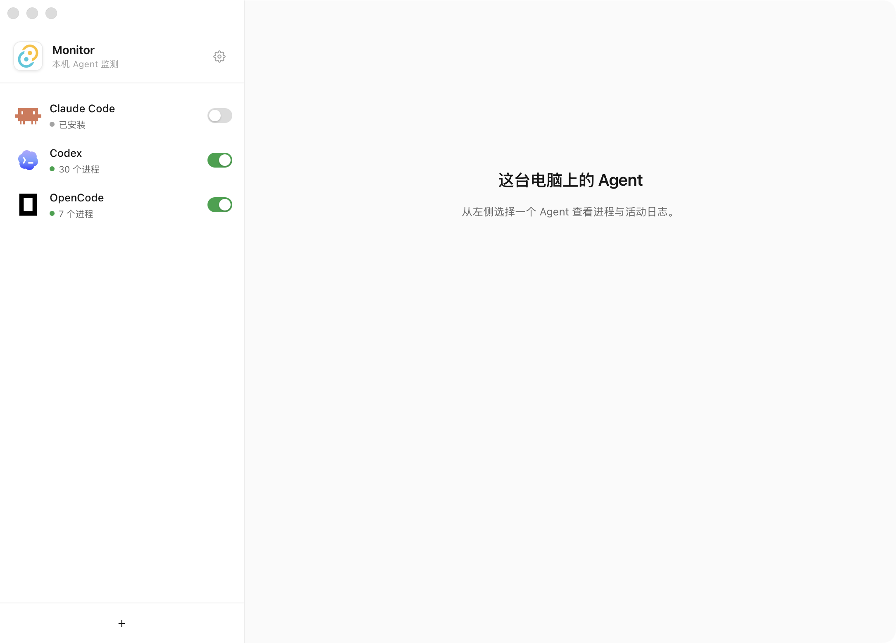

#  Monitor

面向本机 AI 编程 Agent 的桌面监测工具，使用 **Tauri 2、Rust 和 Svelte 5** 构建，以 macOS 为主要开发平台。

按 Agent 查看运行进程与网络活动，并为每个 Agent 配置独立的文件、网络访问策略。无需 Docker，也不需要配置 HTTP 代理。

> **开发中，尚非完整的防泄漏产品。** 实时监测可以使用；系统级拦截已有 Endpoint Security / Network Extension 原型，但规则部署、可信审计回传、实时审批及签名环境联调尚未完成。保存策略或关闭 SIP 都不代表拦截已经生效。

## 软件截图



## 功能

- **Agent 发现**：识别常见应用与 CLI，内置图标；支持手动添加程序和独立监测开关。
- **实时进程与活动**：按 Agent 展示 PID、网络目标及采集到的数据包大小。进程与活动数据仅保留在内存中。
- **macOS 抓包辅助服务**：用户授权安装后，后续启动自动连接，采集已开启监测的 Agent；安装、更新或移除仍可能需要管理员授权。
- **独立访问策略**：仅监测、白名单拦截、访问时询问、禁止联网、AI 拦截。当前保存和校验规则，执行闭环仍在开发。
- **动态项目范围**：根据 Agent 进程工作目录识别项目；原生执行器按进程实例隔离，同一 Agent 在多个项目运行时不合并项目权限。
- **模型 API 例外**：从匹配的 Agent 配置中读取候选地址，用户逐项批准后加入白名单；支持额外可读目录、网络目标与公开网页连接许可。
- **Jev 模型配置**：设置 API 地址、模型和 Key，支持合成请求测试。实时 AI 拦截尚未接通。
- **拦截日志**：按 Agent 查询、导出本地记录，兼容历史数据；规则回放与观察线索不会冒充实际阻断。
- **桌面设置**：简体中文 / English、浅色 / 深色 / 跟随系统、开机启动及关闭窗口到托盘。

## 能力边界

| 能力 | 当前状态 |
| --- | --- |
| Agent 发现、进程与连接采样 | 已实现；轮询可能遗漏短暂活动 |
| macOS 数据包大小采集 | 需要安装并授权辅助服务 |
| 每个 Agent 的规则配置与判定 | 已实现；不等于系统已应用规则 |
| macOS 文件与网络执行器 | 可构建原型，未完成端到端部署验收 |
| 实时询问 / Jev 意图审批 | 尚未接入原生事件 |
| Windows / Linux 系统拦截 | 未实现；基础采样存在平台差异 |

打开源码文件后发生网络连接只是核查线索，不能证明源码已上传。当前不解密 HTTPS；允许模型 API 或网页连接，也可能允许该连接携带代码。名称或路径匹配用于发现 Agent，不是可信签名认证。

系统扩展的具体进度和限制见 [拦截设计](docs/protection.md) 与 [macOS 扩展开发](native/macos/README.md)。

## 本地开发

推荐 Node.js 24、npm、Rust stable。macOS 原生组件需要 Xcode Command Line Tools / macOS SDK：

```sh
xcode-select --install
npm ci
npm run tauri dev
```

如果找不到 `cargo`，先加载 Rust 环境：

```sh
. "$HOME/.cargo/env"
```

`npm run dev` 只启动浏览器预览，不能访问桌面原生采集功能。Windows / Linux 构建还需要对应的 Tauri 原生依赖，参见 [CI 配置](.github/workflows/check.yml)；编译通过不代表具备 macOS 的采集或拦截能力。

### 检查与构建

```sh
cargo fmt --all --check
cargo test --workspace
cargo clippy --workspace --all-targets -- -D warnings
npm run check
npm run build
npm run tauri build
```

`关于Monitor` 显示配置中的版本号和发布时间。发布构建可通过 `MONITOR_RELEASE_DATE=YYYY-MM-DD` 设置日期，默认 `2026-09-22`。

桌面打包产物位于 `target/release/bundle/`。普通桌面构建不会自动完成系统扩展的签名、嵌入、安装和授权。

在 macOS 构建两个独立扩展原型：

```sh
python3 scripts/build_endpoint_extension.py
python3 scripts/build_network_extension.py
```

输出位于 `target/system-extensions/debug/`。签名参数、entitlement 和部署限制见 [扩展开发说明](native/macos/README.md)。

## 权限与数据

普通进程监测不需要关闭 SIP。抓包辅助服务与系统拦截扩展是不同组件：安装抓包服务不会启用文件或网络阻断。

未正式签名的开发版首次运行会检测 SIP 并提供说明，也可从「设置 → 辅助服务」重新查看。临时关闭 SIP 仅用于开发测试，会降低整台电脑的保护；仍需要本地签名、权限声明、正确打包和系统批准。此开发路径尚未在关闭 SIP 的设备上验证。

启动时自动创建用户目录下的 `.monitor`：

| 内容 | 用途 |
| --- | --- |
| `config.json` | 监测开关、自定义 Agent、访问策略及设置 |
| `audit.sqlite3` | 拦截审计与兼容历史记录，最多保留 10000 条 |
| `icons/` | 本机应用图标缓存 |

macOS 上 Jev API Key 保存在登录钥匙串，不返回前端。进程和活动日志不写入数据库；应用不保存抓包文件或源码正文。启用 Jev 测试会向用户配置的服务发送请求摘要。

本地配置和日志不是防篡改存储。导出可能包含程序路径、网络目标等信息；导出只新建文件，不覆盖已有文件。请勿将个人配置、数据库、API Key 或签名证书提交到仓库。

## 命令行工具

```sh
# 无界面监测，Ctrl+C 退出
cargo run -p monitor-runtime --bin monitor-service -- monitor

# 只读扫描历史证据；不代表实时文件访问拦截
cargo run -p monitor-runtime --bin monitor-service -- scan
cargo run -p monitor-runtime --bin monitor-service -- scan trae /path/to/logs
cargo run -p monitor-runtime --bin monitor-service -- watch zcode /path/to/checkpoints

# 使用合成输入回放规则，不执行实际阻断
cargo run -p monitor-replay < fixtures/unknown-egress.json
```

## 项目结构

```text
src/                     Svelte 界面
src-tauri/               桌面桥接、托盘、权限与抓包辅助服务
crates/monitor-core/     策略判定、回放与证据解析
crates/monitor-runtime/  Agent 发现、活动采样、配置、审计及 CLI
crates/monitor-enforcer/ Endpoint Security 与网络规则执行器原型
crates/monitor-replay/   离线回放 CLI
native/macos/            系统扩展入口、权限模板与开发文档
scripts/                 扩展构建脚本
fixtures/                合成测试数据
```

## 参与贡献

欢迎提交可复现的问题和 Pull Request。报告问题时请注明系统版本、芯片架构、构建方式及复现步骤，并移除日志中的私人路径、密钥和请求内容。

涉及拦截行为的修改需提供可控场景测试，区分“规则给出拒绝判定”和“系统实际阻断成功”。本机验证范围与待验收项目见 [验证说明](docs/validation.md)。

## 许可证

项目代码采用 [MIT License](LICENSE)。内置 Agent 图标来源于 LobeHub，保留独立的 [来源说明](static/agent-icons/README.md) 与 [许可证](static/agent-icons/LICENSE)。GitHub 图标来自 [Primer Octicons](https://github.com/primer/octicons)，保留其 [MIT 许可证](static/github-LICENSE)。品牌名称和标识归各自所有者所有，本项目不代表相关厂商。
